# Интеграция Ejudge и GitLab

В данном документе описывается, как подключить репозиторий на GitLab к задаче в Ejudge.
При успешном подключении любой push в репозиторий приводит к автоматическому
скачиванию новой версии программы в Ejudge и её проверке на тестах. Результат
проверки будет доступен в интерфейсе Ejudge.

Предполагается, что аккаунт на GitLab уже создан, ключи для работы через Git+SSH настроены.

## Как это работает

1. Пользователь выполняет push в репозиторий.
2. GitLab выполняет HTTP POST запрос по некоторому адресу, уведомляя стороннюю систему, в нашем случае Ejudge, о том, что состояние репозитория изменилось. Этот механизм называется "webhooks".
3. Ejudge обрабатывает запрос, клонируя репозиторий на GitLab в систему. Для доступа к репозиторию на чтение используется SSH-ключ, так называемый "deploy key", причем у Ejudge должна быть его приватная часть, а у GitLab - публичная часть.
4. Из склонированного репозитория формируется архив, который отправляется на проверку от имени пользователя, настроившего интеграцию, и далее задача обрабатывается стандартным для Ejudge способом.

Если вам всё или многое понятно, то вы можете сразу приступить к настройке интеграции.

## Создание deploy key

Для того чтобы Ejudge мог клонировать репозиторий из GitLab необходим SSH-ключ, причем
у Ejudge должна быть его приватная часть, а в GitLab нужно поместить публичную часть.
Не нужно отдавать в Ejudge приватную часть какого-либо существующего ключа, а лучше всего сгенерировать новый ключ специально для Ejudge.

Если у вас уже есть сгенерированный ранее deploy key для Ejudge, нет необходимости 
генерировать новый ключ для каждой задачи, можно использовать уже существующий. 

```
ssh-keygen -t ed25519 -f ejudge-deploy -C ""
```

Поле "passphrase" оставьте пустым (два раза нажмите "Enter"). В результате должны
быть созданы два файла: `ejudge-deploy` - это приватная часть ключа, и `ejudge-deploy.pub` - это публичная часть ключа.

## Добавление deploy key в репозитории GitLab

На странице проекта выберите пункт меню "Settings".

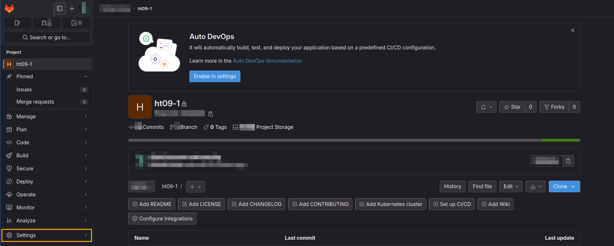

Во всплывающем окне или на странице настроек выберите раздел "Repository".

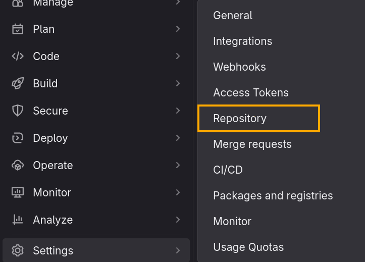

Найдите и выберите пункт "Deploy keys". Нажмите на название пункта или кнопку "Expand" справа.

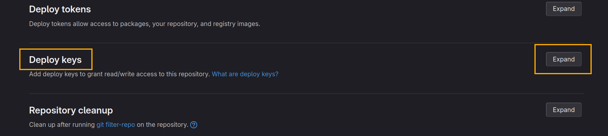

В развернувшемся окне "Deploy keys" нажмите на "Add new key".

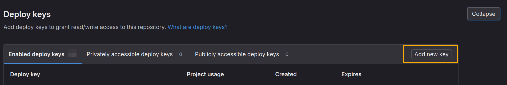

В форме заполните:
1. Имя ключа;
2. поле "Key": скопируйте в него содержимое файла с публичным ключом (`ejudge-deploy.pub`);
3. нажмите "Add key".

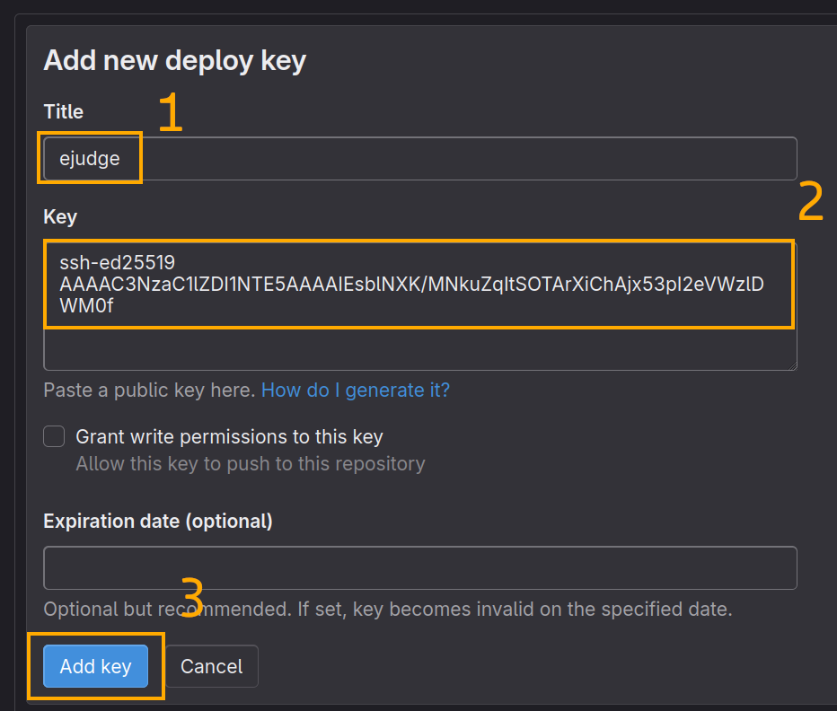

Возможно, после нажатия кнопки GitLab запросит подтверждение операции посредством внеплановой авторизации.

Один и тот же deploy key можно использовать для разных интеграций, например, для сдачи разных задач.

## Добавление webhook в проект в GitLab

Теперь в Ejudge перейдите на страницу с условием задачи и нажмите кнопку "Setup Version Control System Integration" под условием задачи.

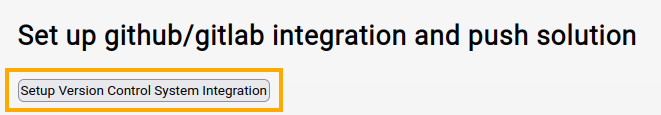

На вопрос о создании новой интеграции ответьте "Ok".

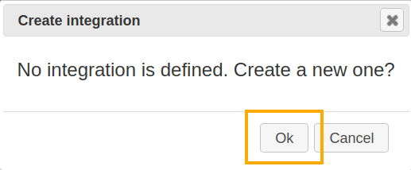

Сейчас нас интересуют поля "Git webhook" и "Git webhook token".

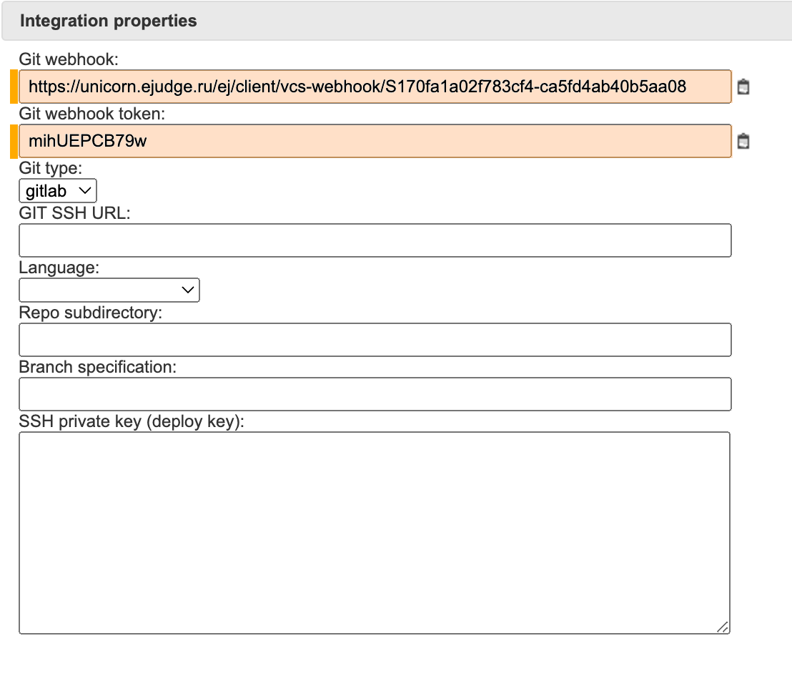

Далее вернитесь на страницу GitLab на страницу "Settings", и в меню слева выберите "Webhooks".

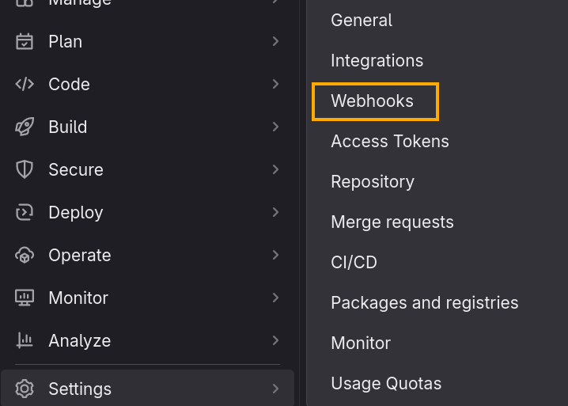

Нажмите "Add new webhook"

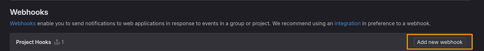

В форме заполните:
1. URL - из поля "Git webhook" формы в Ejudge;
2. Secret token - из поля "Git webhook token" формы в Ejudge;
3. поставьте галочку в пункте "Push events", выбор оставьте без изменений;

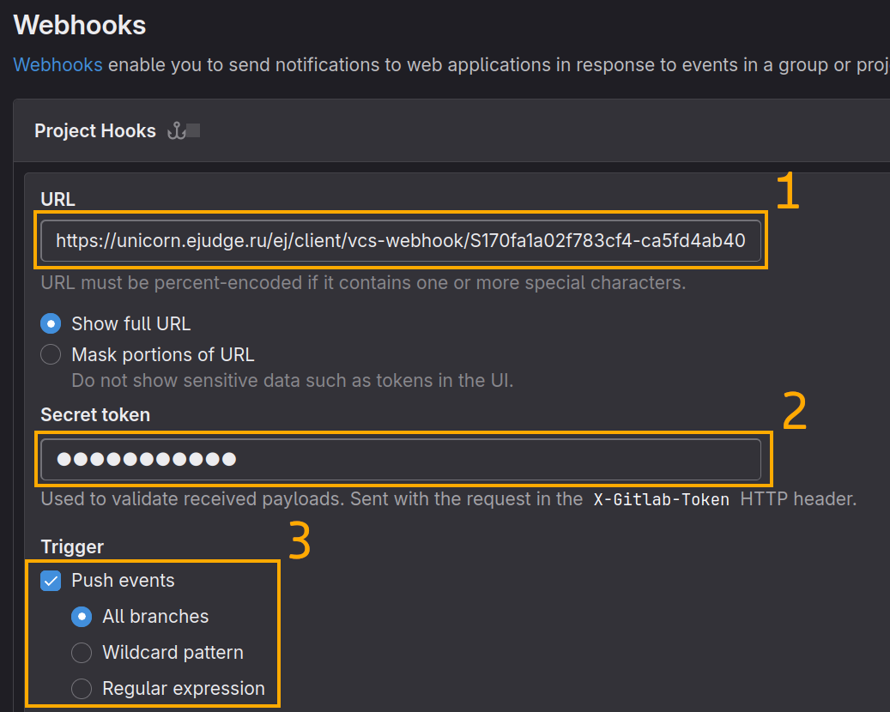

4. поставьте галочку в пункте "Enable SSL verification";
5. остальное оставьте без изменений и нажмите кнопку "Add webhook".

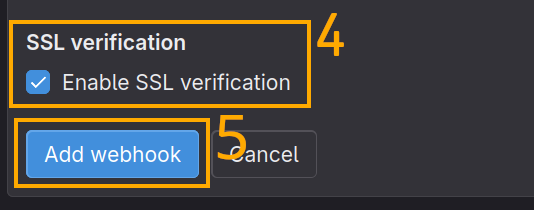

Чтобы убедиться, что webhook успешно добавился, найдите его в  списке webhook'ов и нажмите на кнопку "Edit".

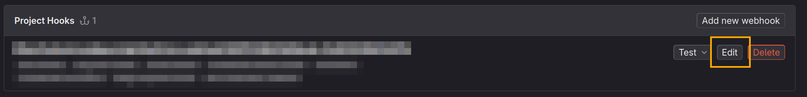

В самом низу страницы находится раздел "Recent events".

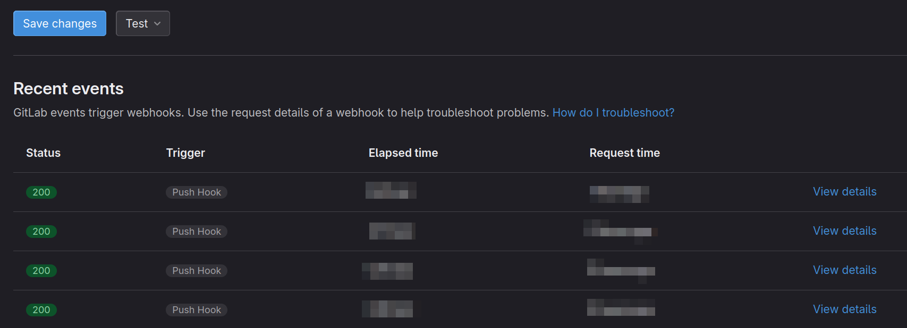

Нажмите на кнопку "Test".

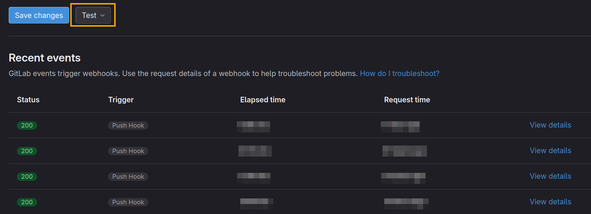

В выпадающем меню нажмите на "Push events".

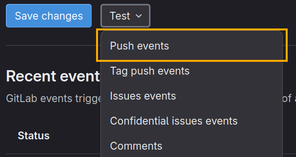

После этого в таблице запросов (как и после настоящих push) появится новая запись. Для того, чтобы посмотреть информацию о запросе, нажмите на "View details".

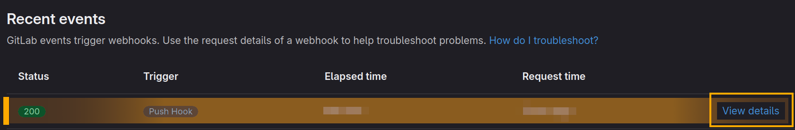

В поле "Response" должен находиться ответ `{ok:true}`


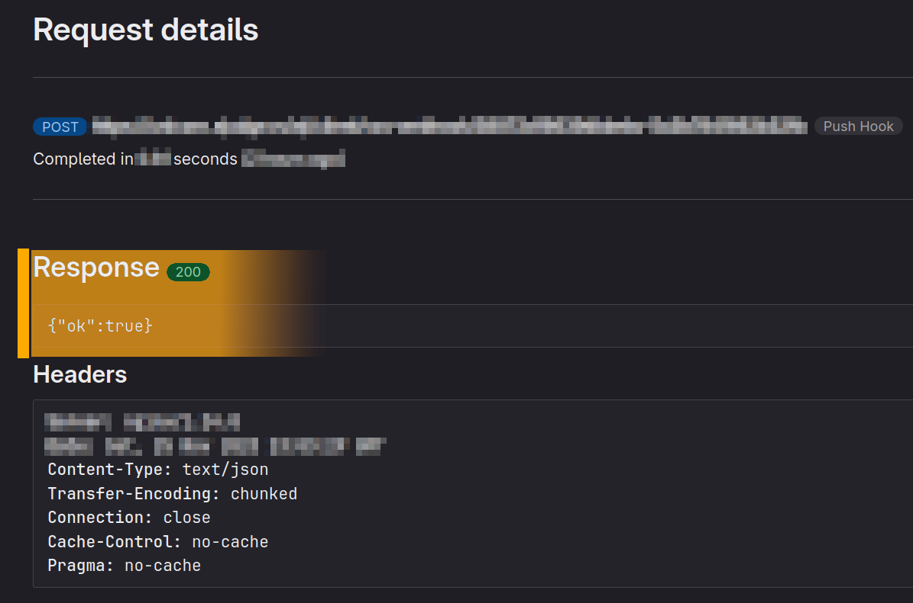

## Настройка интеграции в Ejudge

Для завершения настройки потребуется SSH URL репозитория. Чтобы получить его, перейдите на страницу репозитория в GitLab и нажмите на кнопку "Clone".

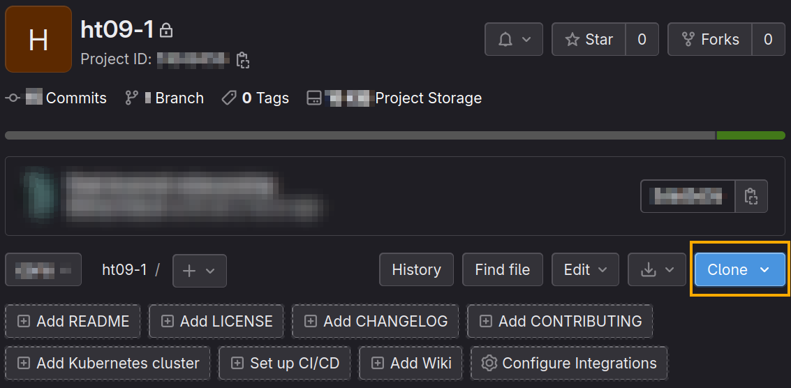

В появившемся окне скопируйте ссылку в разделе "Clone with SSH" вручную или нажмите на кнопку справа от ссылки.

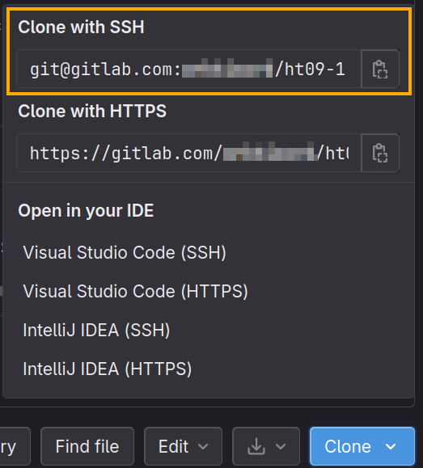

Теперь вернитесь на страницу с условием задачи в Ejudge, на которой должна
быть открыта форма "Integration properties".

Заполните:
1. Поле "Git type" - выберите "gitlab";
2. поле "Git SSH URL" - ссылкой, по которой репозиторий клонируется из GitLab и которую вы скопировали ранее;
3. поле "Language" - выберите нужный язык программирования;
4. поля "Repo subdirectory" и "Branch specification" оставьте пустыми;
5. поле "SSH private key (deploy key)" - скопируйте в это поле приватный ключ (содержимое файла `ejudge-deploy`);
6. Нажмите "Ok".

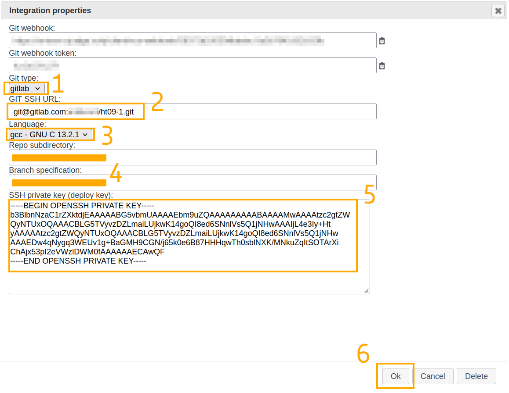

## Успех!

Если вы все сделали правильно, операция push в репозиторий git
приведет к тому, что последняя версия кода будет скачана, скомпилирована
и протестирована.

При просмотре исходного кода в Ejudge вы не увидите непосредственно код,
но специальным образом подготовленный текстовый файл, который содержит
заархивированный каталог с кодом.
